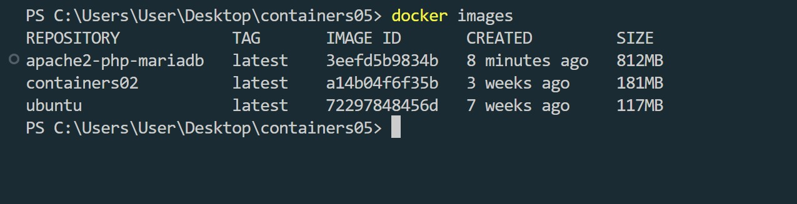
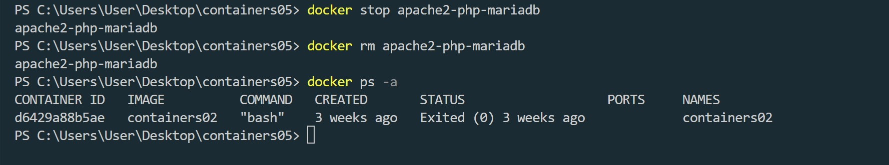
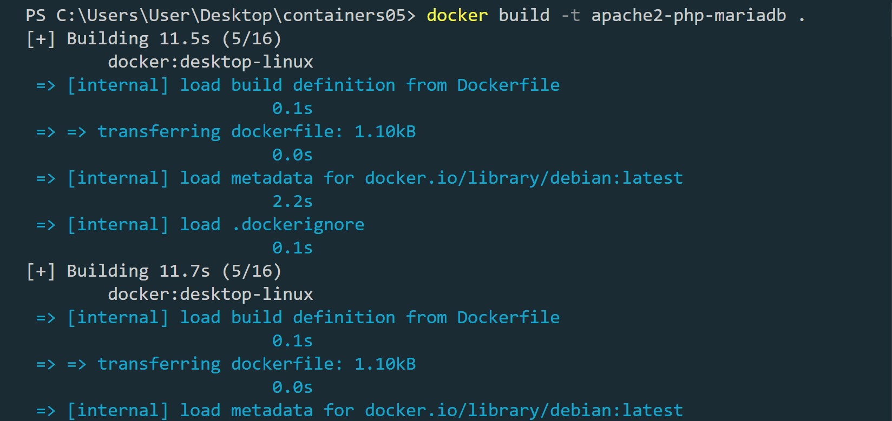

# IWNO5: Запуск сайта в контейнере

## Цель работы

Выполнив данную работу я смогу подготовить образ контейнера для запуска веб-сайта на базе Apache HTTP Server + PHP (mod_php) + MariaDB.

## Задание

Создать Dockerfile для сборки образа контейнера, который будет содержать веб-сайт на базе Apache HTTP Server + PHP (mod_php) + MariaDB. База данных MariaDB должна храниться в монтируемом томе. Сервер должен быть доступен по порту 8000.

Установить сайт WordPress. Проверить работоспособность сайта.

## Подготовка

Для выполнения данной работы необходимо иметь установленный на компьютере Docker. :white_check_mark:

Для выполнения работы необходимо иметь опыт выполнения лабораторной работы №3. :white_check_mark:

## Описание выполнения работы с ответами на вопросы

Создал репозиторий `containers05` и скопировал его себе на компьютер.

```bash
PS C:\Users\User\Desktop> git clone https://github.com/zabudicCloning into 'containers05'...
remote: Counting objects: 100% (3/3), done.
remote: Compressing objects: 100% (2/2), done.
remote: Total 3 (delta 0), reused 0 (delta 0), pack-reused 0 (from 0)
```


Извлечение конфигурационных файлов apache2, php, mariadb из контейнера

Создал в папке containers05 папку files, а также

- папку files/apache2 - для файлов конфигурации apache2;
- папку files/php - для файлов конфигурации php;
- папку files/mariadb - для файлов конфигурации mariadb.


Создал в папке containers05 файл Dockerfile со следующим содержимым:

```bash

# create from debian image

FROM debian:latest

# install apache2, php, mod_php for apache2, php-mysql and mariadb

RUN apt-get update && \
 apt-get install -y apache2 php libapache2-mod-php php-mysql mariadb-server && \
 apt-get clean
```


Построил образ контейнера с именем apache2-php-mariadb.

```bash
docker build -t apache2-php-mariadb .
```


```bash
docker images
```



Создал контейнер apache2-php-mariadb из образа apache2-php-mariadb и запустил его в фоновом режиме с командой запуска bash.


```bash
docker ps -a
```


Скопировал из контейнера файлы конфигурации apache2, php, mariadb в папку files/ на компьютере. Для этого, в контексте проекта, выполнил команды:

```bash
docker cp apache2-php-mariadb:/etc/apache2/sites-available/000-default.conf files/apache2/
docker cp apache2-php-mariadb:/etc/apache2/apache2.conf files/apache2/
docker cp apache2-php-mariadb:/etc/php/8.2/apache2/php.ini files/php/
docker cp apache2-php-mariadb:/etc/mysql/mariadb.conf.d/50-server.cnf files/mariadb/
```


После выполнения команд в папке files/ должны появиться файлы конфигурации apache2, php, mariadb. Проверил их наличие. Остановил и удалил контейнер apache2-php-mariadb.


```bash
docker stop apache2-php-mariadb
docker rm apache2-php-mariadb
docker ps -a
```



## Настройка конфигурационных файлов

### Конфигурационный файл apache2

Открыл файл files/apache2/000-default.conf, нашёл строку #ServerName www.example.com и заменил её на ServerName localhost.

Нашёл строку ServerAdmin webmaster@localhost и заменил в ней почтовый адрес на свой.

После строки DocumentRoot /var/www/html добавил следующие строки:

```bash
 DirectoryIndex index.php index.html
```

Сохранил файл и закрыл.


В конце файла files/apache2/apache2.conf добавил следующую строку:

ServerName localhost


### Конфигурационный файл php

Открыл файл `files/php/php.ini`, нашёл строку `;error_log = php_errors.log` и заменил её на `error_log = /var/log/php_errors.log`.


Настроил параметры memory_limit, upload_max_filesize, post_max_size и max_execution_time следующим образом:

```bash
memory_limit = 128M
upload_max_filesize = 128M
post_max_size = 128M
max_execution_time = 120
```


Сохранил файл и закрыл.

### Конфигурационный файл mariadb

Открыл файл files/mariadb/50-server.cnf, нашёл строку #log_error = /var/log/mysql/error.log и раскомментировал её.


Сохранил файл и закрыл.

## Создание скрипта запуска

Создал в папке `files` папку `supervisor` и файл `supervisord.conf` со следующим содержимым:

```bash

[supervisord]
nodaemon=true
logfile=/dev/null
user=root

# apache2
[program:apache2]
command=/usr/sbin/apache2ctl -D FOREGROUND
autostart=true
autorestart=true
startretries=3
stderr_logfile=/proc/self/fd/2
user=root

# mariadb
[program:mariadb]
command=/usr/sbin/mariadbd --user=mysql
autostart=true
autorestart=true
startretries=3
stderr_logfile=/proc/self/fd/2
user=mysql
```


## Создание Dockerfile

Открыл файл `Dockerfile` и добавил в него следующие строки:

- после инструкции `FROM` ... добавил монтирование томов:

```bash
# mount volume for mysql data
VOLUME /var/lib/mysql

# mount volume for logs
VOLUME /var/log
```

- в инструкции `RUN` ... добавил установку пакета supervisor.

- после инструкции `RUN` ... добавил копирование и распаковку сайта WordPress:

```bash
# add wordpress files to /var/www/html
ADD https://wordpress.org/latest.tar.gz /var/www/html/
```

- после копирования файлов WordPress добавил копирование конфигурационных файлов apache2, php, mariadb, а также скрипта запуска:

```bash

# copy the configuration file for apache2 from files/ directory
COPY files/apache2/000-default.conf /etc/apache2/sites-available/000-default.conf
COPY files/apache2/apache2.conf /etc/apache2/apache2.conf

# copy the configuration file for php from files/ directory
COPY files/php/php.ini /etc/php/8.2/apache2/php.ini

# copy the configuration file for mysql from files/ directory
COPY files/mariadb/50-server.cnf /etc/mysql/mariadb.conf.d/50-server.cnf

# copy the supervisor configuration file
COPY files/supervisor/supervisord.conf /etc/supervisor/supervisord.conf
```

- для функционирования mariadb Создал папку `/var/run/mysqld` и установил права на неё:

```bash
# create mysql socket directory
RUN mkdir /var/run/mysqld && chown mysql:mysql /var/run/mysqld
```

- Открыл порт 80.

- добавил команду запуска supervisord:

```bash
# start supervisor
CMD ["/usr/bin/supervisord", "-n", "-c", "/etc/supervisor/conf.d/supervisord.conf"]
```

`Dockerfile`

```bash

FROM debian:latest

VOLUME /var/lib/mysql

VOLUME /var/log

RUN apt-get update && \
    apt-get install -y apache2 php libapache2-mod-php php-mysql mariadb-server supervisor tar && \
    apt-get clean

ADD https://wordpress.org/latest.tar.gz /tmp/wordpress.tar.gz

RUN tar -xzf /tmp/wordpress.tar.gz -C /var/www/html/ && \
    mv /var/www/html/wordpress/* /var/www/html/ && \
    rm -rf /var/www/html/wordpress /tmp/wordpress.tar.gz

COPY files/apache2/000-default.conf /etc/apache2/sites-available/000-default.conf
COPY files/apache2/apache2.conf /etc/apache2/apache2.conf

COPY files/php/php.ini /etc/php/8.2/apache2/php.ini

COPY files/mariadb/50-server.cnf /etc/mysql/mariadb.conf.d/50-server.cnf

COPY files/supervisor/supervisord.conf /etc/supervisor/supervisord.conf

COPY files/wp-config.php /var/www/html/wordpress/wp-config.php

# create mysql socket directory
RUN mkdir /var/run/mysqld && chown mysql:mysql /var/run/mysqld

EXPOSE 80

CMD ["/usr/bin/supervisord", "-n", "-c", "/etc/supervisor/supervisord.conf"]

```

Собрал образ контейнера с именем `apache2-php-mariadb` и запустил контейнер `apache2-php-mariadb` из образа `apache2-php-mariadb`. Проверил наличие сайта WordPress в папке `/var/www/html/`. Проверил изменения конфигурационного файла `apache2`.

```bash

docker run -ti -p 8000:80 --name apache2-php-mariadb apache2-php-mariadb bash
ls  /var/www/html
```


## Создание базы данных и пользователя

Создал базу данных `wordpress` и пользователя `wordpress` с паролем `wordpress` в контейнере `apache2-php-mariadb`. Для этого, в контейнере `apache2-php-mariadb`, выполнил команды:

```mysql

CREATE DATABASE wordpress;
CREATE USER 'wordpress'@'localhost' IDENTIFIED BY 'wordpress';
GRANT ALL PRIVILEGES ON wordpress.* TO 'wordpress'@'localhost';
FLUSH PRIVILEGES;
EXIT;
```


## Создание файла конфигурации WordPress

Открыл в браузере сайт WordPress по адресу http://localhost/. Указал параметры подключения к базе данных:

- имя базы данных: wordpress;
- имя пользователя: wordpress;
- пароль: wordpress;
- адрес сервера базы данных: localhost;
- префикс таблиц: wp\_.


Скопировал содержимое файла конфигурации в файл files/wp-config.php на компьютере.


## Добавление файла конфигурации WordPress в Dockerfile

добавил в файл Dockerfile следующие строки:

```bash
# copy the configuration file for wordpress from files/ directory
COPY files/wp-config.php /var/www/html/wordpress/wp-config.php
```

## Запуск и тестирование

ПереСобрал образ контейнера с именем `apache2-php-mariadb` и запустил контейнер `apache2-php-mariadb` из образа `apache2-php-mariadb`. Проверил работоспособность сайта WordPress.

```bash
docker build -t apache2-php-mariadb .
```



```bash
docker run -d -p 8000:80 --name apache2-php-mariadb apache2-php-mariadb

docker exec -it apache2-php-mariadb bash
ls /var/www/html/wordpress
```


## Ответы на вопросы

### 1. Какие файлы конфигурации были изменены?

- `000-default.conf`
- `apache2.conf`
- `php.ini`
- `50-server.cnf`

Добавил `supervisor.conf` и написал `Dockerfile`

### 2. За что отвечает инструкция DirectoryIndex в файле конфигурации apache2?

Инструкция DirectoryIndex указывает что будети загруженно по умолчанию, при условии что мы не укажем другого файла в запросе

### 3. Зачем нужен файл wp-config.php?

В `wp-config.php` содержатся настройки WordPress. Там находятся имя хоста, пароль от базы данных и.т.д

### 4. За что отвечает параметр post_max_size в файле конфигурации php?

`post_max_size` указывает максимальный размер `body` для `POST` запросов

### 5. Укажите, на ваш взгляд, какие недостатки есть в созданном образе контейнера?

Веб-сервер и база данных запускаются в одном и том же контейнере, было бы лучше разделить и запустить в двух разных для безопасности, удобства и расширяемости.

## Выводы

Выполняя эту работу, я сделал следующее:

1. Запустил сайт wordpress внутри контейнера, настроив веб-сервер (Apache) и базу данных (MariaDB).
2. Добавил `supervisor` для управления несколькими сервисами.
3. Установил Wordpress и сконфигурировал его.

Выполнение данной работы было познавательно и полезно.
